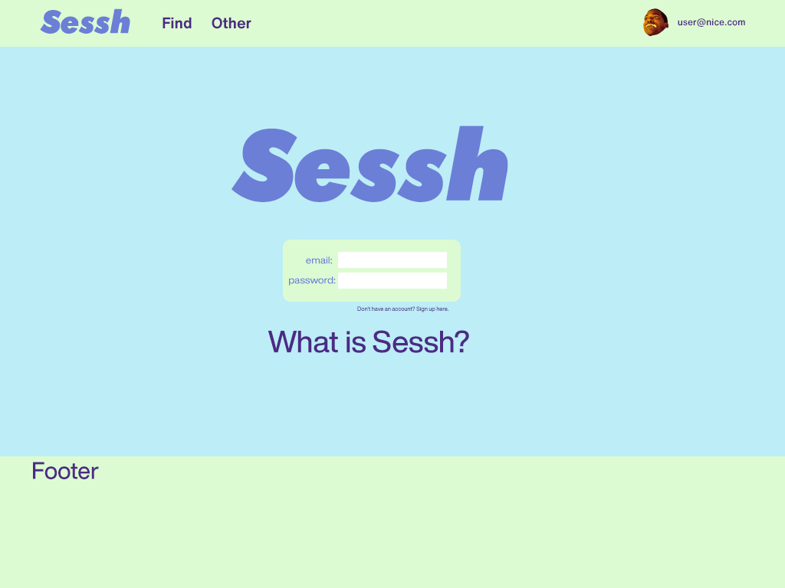
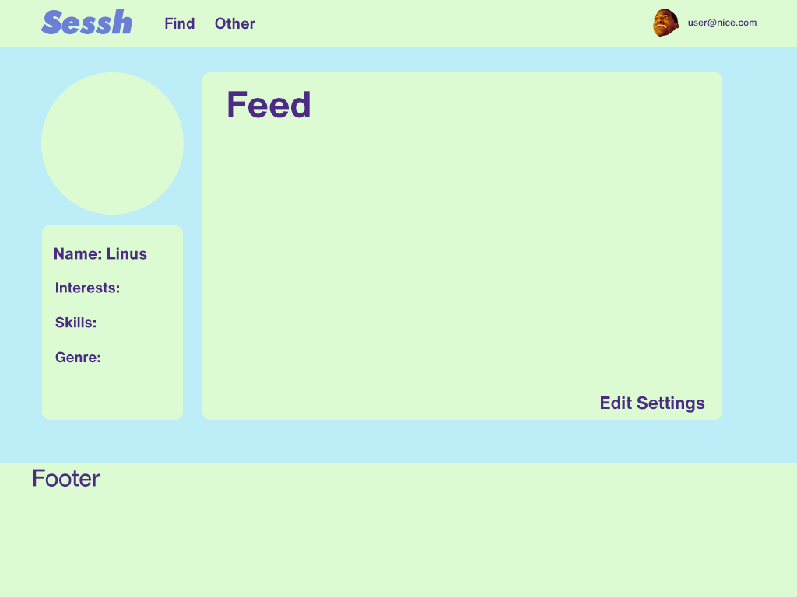
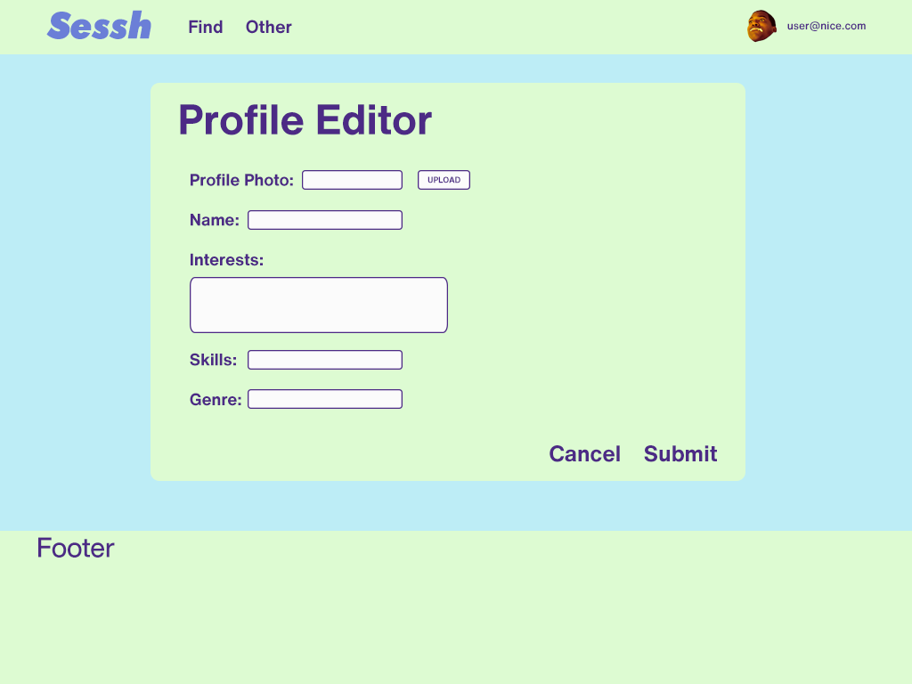
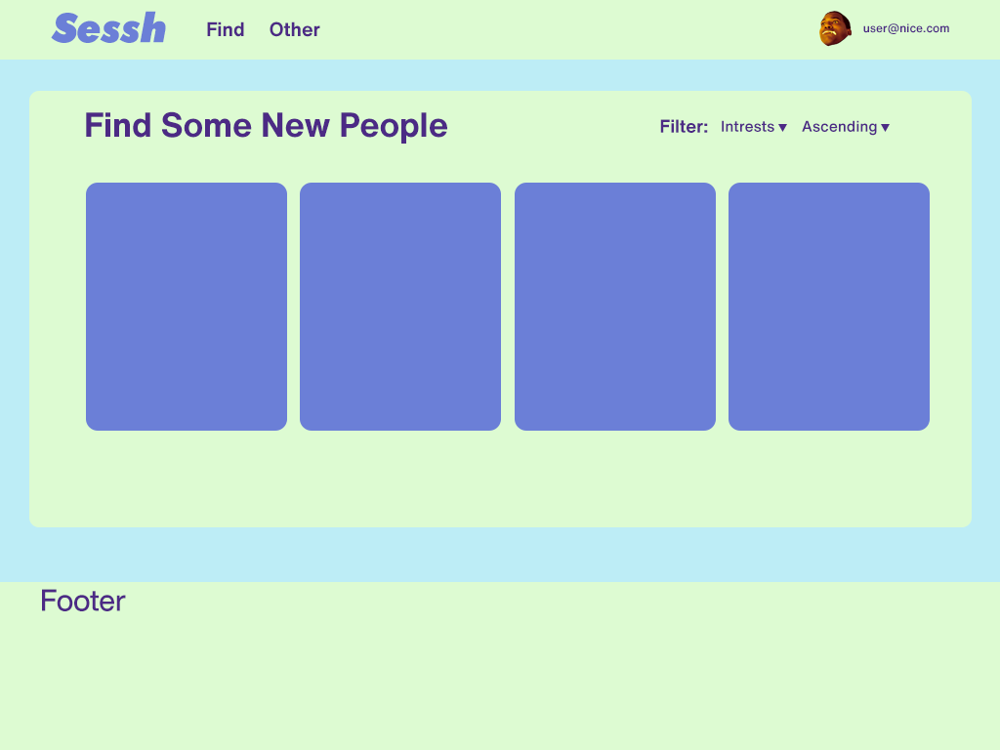

## Welcome
This home page is dedicated to documenting our projects. Currently we are working
on a web application called Sessh. You can read more about the project and 
our goals below.

## Who We Are
* Kaiwi Akioka
* Edward Birtodaso
* Josh Constantino
* Waylon Ho
* Ian Iwata

## Sessh
### What Is Sessh?
Let's say you need a drummer for your band, looking for someone to teach you how to learn
certain chord pattern, or just want some people to jam with. Finding other
individuals who wish to pursue musical related goals can be difficult, especially
when there is no reliable resource to do so. That's were Sessh comes in, we hope
to develop a web application dedicated to cultivating a network of students who are musically inclined and enrolled at a University of Hawaii affiliated school. 

### How Will it Work?
We are aiming to provide the fundamental tools necessary to bring students together
so that they can arrange organized meet ups for anyone interested. We will first start with a CRUD(create, read, update, and delete) based design for our initial tools including:
* Creation of profiles including descriptions such as musical interests, goals, skills, etc.
* Profiles will contain access to musical works they produced with links to other work they
    were involved in.
* Full browsing with dedicated filtering capabilities where a user can search for others based on information listed on their profiles.
* Adding people to your regular sessions list.
* Notifications based on search terms.

Along with the feature suite, there will be a dedicated group of 'super-users' with admin
capabilities that ensure the website adheres to our applications policy.

### What Will it Look Like?
Here are some mockups of what we intend the site to look like.

Landing page that will show what the project aims to do.

If a user is interested in joining, they can sign up.

If user is already a member they will be greeted with their dashboard after
logging in.

If they want to update their page, they will go to their edit profile page.

When looking for people to jam with they will visit the search page.
